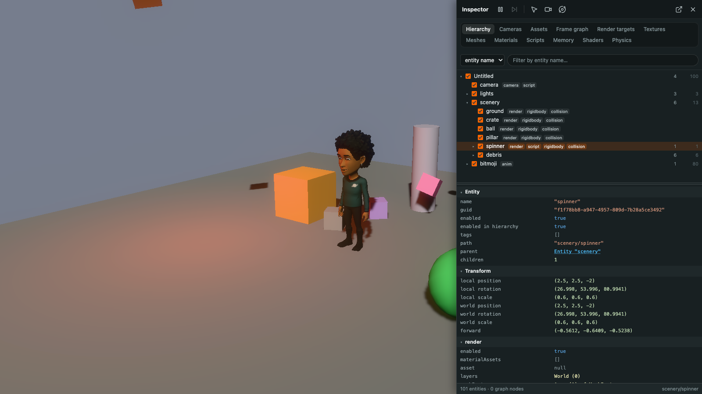
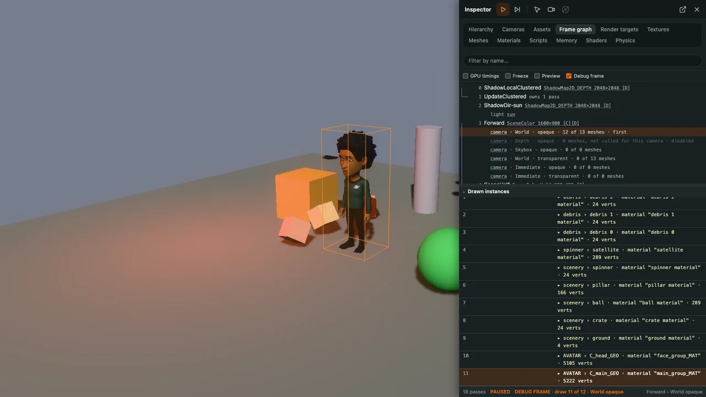

# PlayCanvas Inspector

[](https://www.npmjs.com/package/@playcanvas/inspector)
[](https://npmtrends.com/@playcanvas/inspector)
[](https://github.com/playcanvas/inspector/blob/main/LICENSE)
[](https://discord.gg/RSaMRzg)
[](https://www.reddit.com/r/PlayCanvas)
[](https://x.com/intent/follow?screen_name=playcanvas)

| [User Manual](https://developer.playcanvas.com) | [Blog](https://blog.playcanvas.com) | [Forum](https://forum.playcanvas.com) |

A debug panel for running [PlayCanvas](https://github.com/playcanvas/engine) apps. It shows the entity
hierarchy and every component's properties, and tabs for the cameras, assets, frame graph, render
targets, textures, meshes, materials, scripts, memory, shaders and physics of the app, with live
previews of textures and render targets, picking and flying in the view, and a debug frame mode
that steps through the draw calls of a render pass.

The inspector is read-only, apart from toggling entities on and off, pausing and stepping the app,
and view-only overrides (render modes, wireframe, a flown or orbited camera) it removes when it
closes.



## Install

```sh
npm install @playcanvas/inspector
```

It requires PlayCanvas Engine 2.23 or newer. `playcanvas` is a peer dependency: the inspector works
on your app's own engine, so it must be the same `playcanvas` package your app imports.

TypeScript declarations are included, generated from the JSDoc of the sources.

## Use

```javascript
import { Inspector } from '@playcanvas/inspector';

const inspector = new Inspector(app, { dock: 'left', width: 480 });
```

Press <kbd>`</kbd> to show or hide the panel, <kbd>F9</kbd> to pause and <kbd>F10</kbd> to step a
frame while paused. The keys, dock side, width and more are options of the constructor.

Or, from the Editor or a scripted scene, as a script on an entity:

```javascript
import { EntityInspector } from '@playcanvas/inspector';

const entity = new Entity('inspector');
entity.addComponent('script');
entity.script.create(EntityInspector, { properties: { dock: 'left' } });
app.root.addChild(entity);
```

### Step through a frame

In the Frame graph tab, select a forward pass or one of its layer steps and turn on **Debug frame**.
The app pauses and the pass draws only up to the selected draw; the arrow keys step through the
draws one at a time, with each one outlined in the view and listed with its mesh and material. It
needs the debug build of the engine.



## Engine versions

Each inspector release names the engine versions it supports in its `playcanvas` peer dependency.
The inspector reads engine internals to show what it shows, so a new engine release can need a new
inspector release. The range takes later 2.x releases but not prereleases of them, such as
`2.24.0-beta.1`, as npm does not match prereleases of other versions than the range names.

## The devtools hook

From engine 2.23, every PlayCanvas app announces itself to a hook defined on the global object,
which is how the upcoming browser extension finds apps on any page:

```javascript
globalThis[Symbol.for('playcanvas.inspector')] = {
    register(app, { version, revision, protocol }) {},
    unregister(app) {}
};
```

The hook must be defined before the engine creates the app. `register` is called once each app is
initialized, and `unregister` when it is destroyed. `protocol` is `1`.

## Development

Node 22.19 or newer.

```sh
npm install
npm run lint
npm test
npm run build:types # writes the TypeScript declarations to types/
npm run test:types  # compiles a TypeScript usage of the package against them
npm run publint     # checks the package is publishable
```

The tests run against the `playcanvas` version in `devDependencies`, on the engine's null graphics
device under jsdom.

A few engine helpers the inspector draws with are copied into `src/renderers`, `src/picker` and
`src/input`, so the inspector does not depend on them being in the app's engine build. See
[COPIED_FROM.md](COPIED_FROM.md).

## License

MIT
